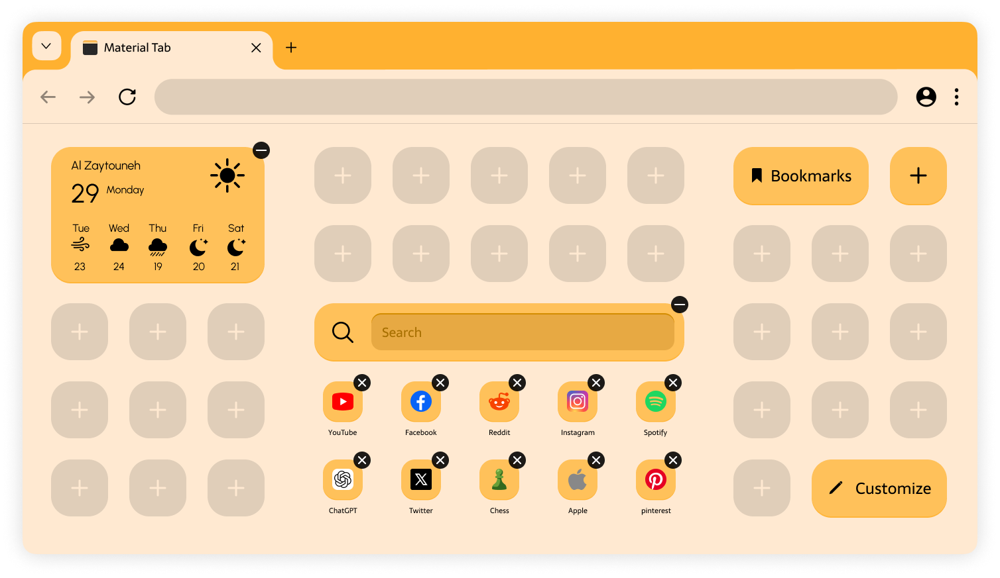
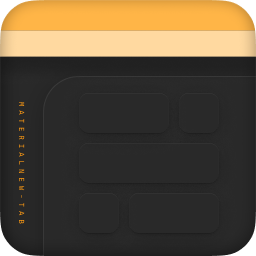

# Material New Tab

A new-tab extension for Chromium browsers inspired by Material Design.

## Overview

Material New Tab is designed mainly to solve two issues:

1. The lack of color customization in browsers.
   - Most browsers are restricted to dark or light themes, and even if they offer additional colors, they are usually not customizable.
2. The lack of interoperability of the new tab between different browsers.
   - Each browser has its own new tab page, which is hardly customizable, making it hard to switch browsers.

## The Material New Tab Approach

Material New Tab is set to be an extension, making it installable on all Chromium browsers. It functions on the basis of an app grid; the new tab space is utilized efficiently. It is divided into a set of square cells, each cell representing a basic space unit similar to how mobile app grids work. These cells can be used to place apps/web shortcuts and widgets that vary in their sizes. This approach is highly customizable while maintaining order.

Here's a look at how Material New Tab will look:

Additionally, the extension will allow primary and secondary color picking to customize the new tab. It will also offer a Chrome theme generation to apply the theme browser-wide.

## Disclaimer

> **Changing the browser theme is prohibited for extensions for safety reasons by the browser itself.**
>
> The only way I could provide browser theming is by giving the user the theme so they can manually install it.

## Features

- **Grid Layout:** Add or remove items anywhere on the new tab page.
- **Customizable Widgets:** Add, remove, and customize widgets with different sizes to personalize your new tab page.
- **Quick Access Apps:** Pin your favorite websites on the new tab page for easy access.
- **Independent Bookmarks Menu:** Access your browser bookmarks easily regardless of the browser.
- **Beautiful Design:** Switch between a material design that matches your colors, or use the monochrome style for a classy look.
- **Themes:** Choose your favorite colors to change the new page look.
- **Theme Generation:** Generate a theme that can be applied to the browser itself to match the new tab color.
- **Sync Your Preferences:** Optionally sync your Material New Tab preferences and pins to your Google account.

Preview of the grid layout:

## Concept Illustrations

The Material New Tab Logo represents a browser page that shows the material colors and the app grid.

Browser window's medium width look:

Browser window's minimum width look:

Customization menu:

App shortcuts creation form:

Widget addition library:

Bookmarks menu:

## Contact

For questions or feedback, please contact [majed.alghoul3@gmail.com](mailto:majed.alghoul3@gmail.com)
